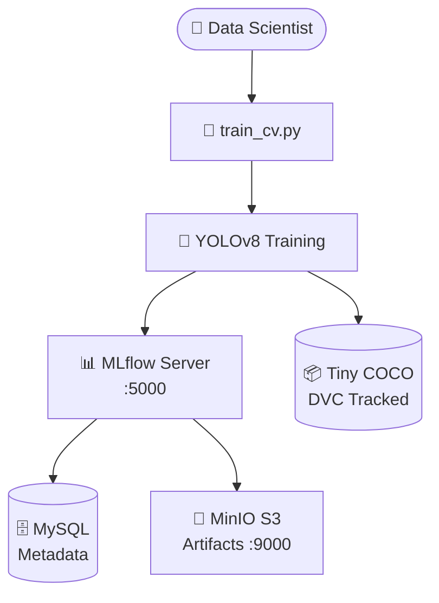
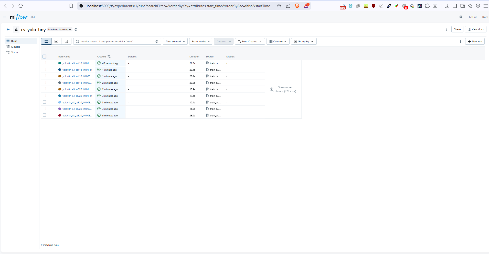
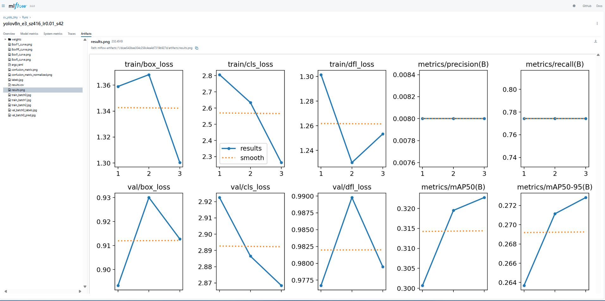

# 📊 Experiment Tracking avec MLflow

[](https://www.python.org/)
[](https://mlflow.org/)
[](https://docs.ultralytics.com/)
[](https://www.docker.com/)
[](https://dvc.org/)

## 📋 Vue d'Ensemble

Ce projet démontre l'utilisation de **MLflow** pour le tracking d'expériences de détection d'objets avec **YOLOv8 tiny** sur un dataset ultra-léger. L'infrastructure utilise **Docker Compose** pour orchestrer MLflow, MinIO et MySQL, permettant une gestion complète des expériences ML.

### 🎯 Objectifs du Projet

- Utiliser MLflow pour tracer plusieurs runs de détection d'objets (YOLO tiny)
- Comparer les runs dans l'UI MLflow et analyser les métriques (mAP, précision, rappel)
- Consigner la décision de promotion du meilleur modèle
- Enregistrer le modèle choisi dans le Model Registry (Stage : Staging/Production)

### ✨ Fonctionnalités Clés

- **📊 MLflow Tracking** : Suivi complet des paramètres, métriques et artefacts
- **🔍 Comparaison de Runs** : Interface UI pour comparer les performances
- **💾 MinIO S3** : Stockage d'artefacts cloud-ready compatible AWS S3
- **📦 DVC** : Versionnage robuste des datasets pour reproductibilité
- **🐳 Docker Compose** : Infrastructure complète containerisée

---

## 🏗️ Architecture Technique



### Stack Technologique

| Composant | Version | Rôle | Port |
|-----------|---------|------|------|
| **MLflow** | 2.9+ | Experiment tracking & model registry | 5000 |
| **MinIO** | Latest | Stockage artefacts S3-compatible | 9000, 9001 |
| **MySQL** | 8.0 | Backend database MLflow | 3306 |
| **YOLOv8** | ultralytics | Modèle de détection d'objets | - |
| **DVC** | 3.0+ | Versionnage de données | - |

---

## 🚀 Installation et Configuration

### Prérequis

- **Python 3.11+**
- **Git** et **DVC**
- **Docker Desktop** (pour MLflow et MinIO)
- **PowerShell** (Windows) ou **bash** (Linux/macOS)

### Étape 1 : Cloner le Dépôt

```bash
git clone https://github.com/chaima-massaoudi/Experiment-Tracking-avec-MLflow.git
cd mlflow-cv-yolo
```

### Étape 2 : Préparation de l'Environnement Python

```powershell
# Windows PowerShell
python -m venv .venv
.\.venv\Scripts\Activate.ps1
python -m pip install --upgrade pip
pip install -r requirements.txt
```

```bash
# Linux/macOS
python3 -m venv .venv
source .venv/bin/activate
python -m pip install --upgrade pip
pip install -r requirements.txt
```

### Étape 3 : Génération du Mini-Dataset

```bash
# Générer le dataset minimal (60 images, 1 classe: person)
python tools/make_tiny_person_from_coco128.py

# Tracker avec DVC
dvc init
dvc add data/tiny_coco -R
git add data/tiny_coco.dvc .gitignore .dvc/ .gitattributes
git commit -m "Track dataset tiny_coco with DVC"
```

### Étape 4 : Démarrer l'Infrastructure Docker

```bash
docker compose up -d
docker compose ps
```

**Accès aux interfaces :**
- 📊 **MLflow UI** : http://localhost:5000
- 💾 **MinIO Console** : http://localhost:9001 (credentials dans `mlflow.env`)

### Étape 5 : Configuration des Variables d'Environnement

```powershell
# Windows PowerShell
$env:MLFLOW_TRACKING_URI = "http://localhost:5000"
```

```bash
# Linux/macOS
export MLFLOW_TRACKING_URI=http://localhost:5000
```

---

## 🏃‍♂️ Exécution des Expériences

### 1. Run Baseline

```bash
python -m src.train_cv --epochs 3 --imgsz 320 --exp-name cv_yolo_tiny
```

### 2. Grille de Runs (8 configurations)

```powershell
# Windows PowerShell
powershell -ExecutionPolicy Bypass -File scripts\run_grid.ps1
```

```bash
# Linux/macOS
chmod +x scripts/run_grid.sh
bash scripts/run_grid.sh
```

**Configurations testées :**
- Tailles d'image : 320, 416
- Learning rates : 0.005, 0.01
- Seeds : 1, 42
- Epochs : 3 (fixe)

---

## 📊 Analyse et Comparaison

### Résultats de la Grille

| Run | Epochs | ImgSz | LR | Seed | mAP@50-95 | mAP@50 | Precision | Recall |
|-----|--------|-------|-----|------|-----------|--------|-----------|--------|
| **Run 1** | 3 | 416 | 0.01 | 42 | **0.2729** | 0.3228 | 0.008 | 0.7742 |
| Run 2 | 3 | 416 | 0.01 | 1 | 0.2586 | 0.3013 | 0.008 | 0.7742 |
| Run 3 | 3 | 320 | 0.01 | 42 | 0.2314 | 0.2751 | 0.0084 | 0.7097 |
| Run 4 | 3 | 320 | 0.005 | 42 | 0.2250 | 0.2680 | 0.0078 | 0.6935 |

### Insights Clés

- 🏆 `imgsz=416` surpasse `imgsz=320` (+19% de mAP@50-95)
- 🏆 `lr=0.01` est optimal (vs 0.005)
- 🏆 `seed=42` légèrement meilleur que `seed=1` (variance < 6%)

**Configuration gagnante** : `epochs=3, imgsz=416, lr=0.01, seed=42`

### Artefacts Disponibles

Pour chaque run, MLflow stocke :
- `results.png` : Courbes d'entraînement
- `confusion_matrix.png` : Matrice de confusion
- `PR_curve.png` : Courbe Précision-Recall
- `F1_curve.png` : Courbe F1-score
- `weights/best.pt` : Meilleur modèle
- `weights/last.pt` : Dernier checkpoint

---

## 📸 Captures d'écran


*Vue d'ensemble des runs dans l'interface MLflow*


*Courbes d'entraînement - Loss, mAP, Precision, Recall par époque*

---

## 📝 Décision de Promotion

### Candidat Retenu : Run 1

- **Paramètres** : epochs=3, imgsz=416, lr=0.01, seed=42
- **Performance** : mAP@50-95 = 0.2729 (meilleur score)
- **Décision** : ✅ Promotion en **Staging**

---

## 📚 Ressources

- [Documentation MLflow](https://mlflow.org/docs/latest/)
- [Documentation DVC](https://dvc.org/doc)
- [Guide YOLOv8 Ultralytics](https://docs.ultralytics.com/)
- [Dataset COCO](https://cocodataset.org/)
